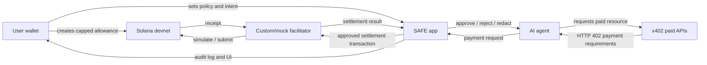
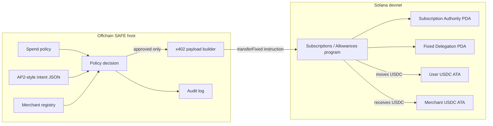
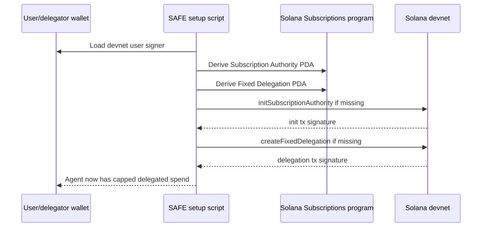
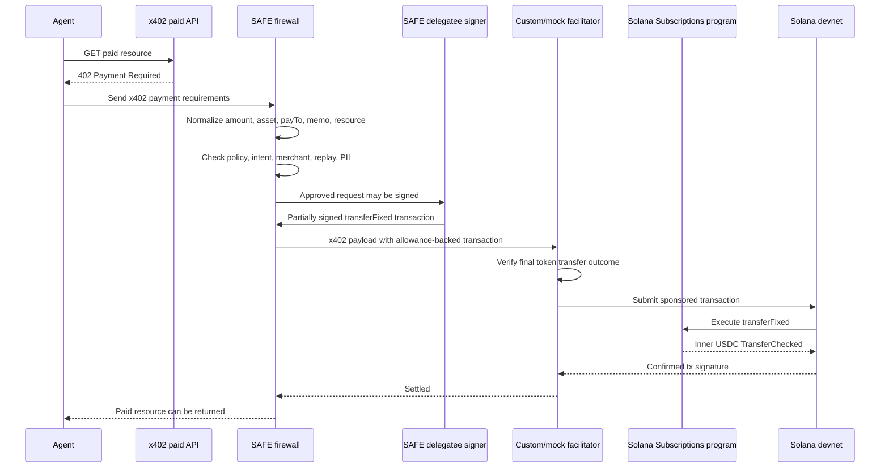
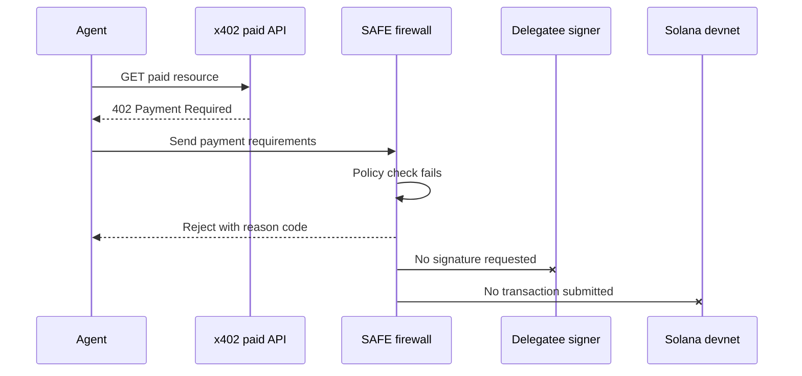
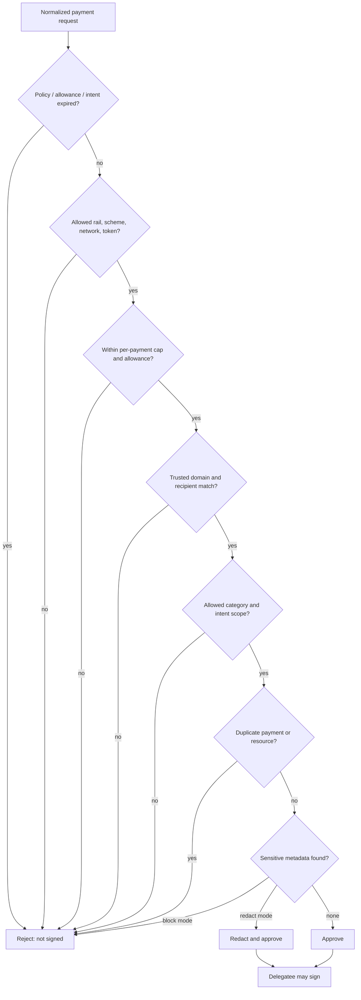
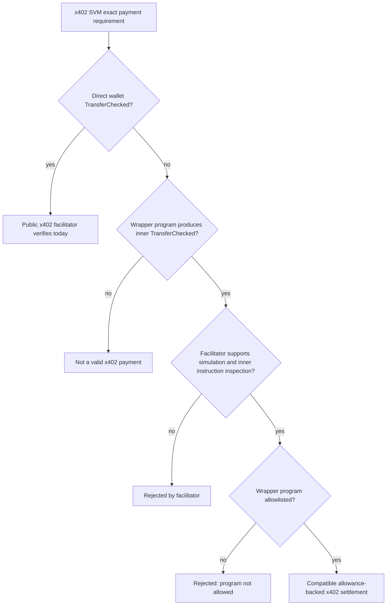
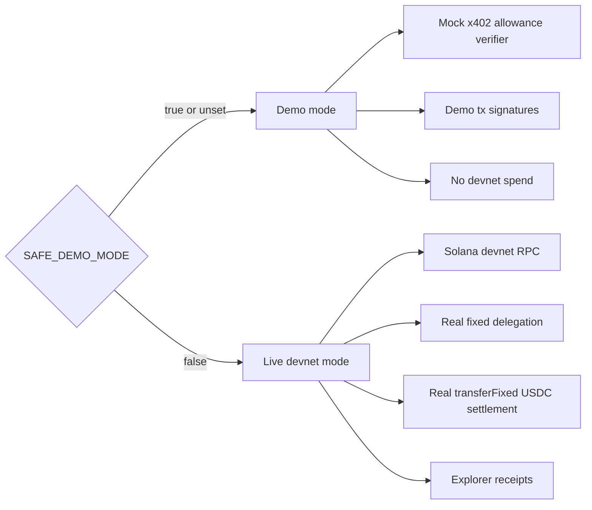

# SAFE Architecture

Current as of June 19, 2026.

SAFE means Spend Authorization Firewall for Agents. It is a buyer-side payment firewall for AI agents. The demo shows an agent trying to buy paid API resources, while SAFE decides whether the delegated signer is allowed to sign and settle each payment.

The core idea is simple:

```text
Solana allowance = hard spending boundary.
x402 = per-request paid API challenge.
SAFE = policy firewall before signing.
Facilitator = verifies and settles the signed payment transaction.
```

## Current State

What works now:

- Live Solana devnet fixed allowance setup.
- Live official devnet USDC settlement through Solana Subscriptions/Allowances.
- Real `transferFixed` devnet transactions for approved agent payments.
- SAFE policy checks for amount, merchant, recipient, category, duplicate requests, intent scope, and PII.
- Mock/custom facilitator verification for allowance-backed settlement.
- Public x402 verification probe.

Important x402 boundary:

- Public x402 works for a standard direct Solana wallet payment.
- Public x402 currently rejects SAFE's allowance-backed `transferFixed` wrapper because the public facilitator does not allowlist the Solana Subscriptions/Allowances program.
- Therefore the hackathon demo should describe allowance-backed x402 settlement as requiring a custom/self-hosted or allowlisted facilitator.

## System Context



SAFE is not trying to replace x402 or Solana allowances. SAFE sits between the agent and the signer.

## Main Components

```mermaid
flowchart TB
  subgraph UI[Next.js app]
    Dashboard[Dashboard]
    AgentRun[/api/agent/run]
    Preflight[/api/preflight]
    PolicyAPI[/api/policy]
    AuditAPI[/api/audit]
  end

  subgraph Policy[SAFE policy layer]
    Normalizer[x402 payment normalizer]
    Engine[policyEngine]
    Replay[replay guard]
    PII[PII scanner]
    Registry[merchant registry]
    Audit[audit log]
  end

  subgraph SolanaLayer[Solana layer]
    Runtime[runtimePreflight]
    LiveSettlement[liveSettlement]
    AllowanceAdapter[allowance adapter]
    Subscriptions[@solana/subscriptions]
    Token[@solana-program/token]
    Kit[@solana/kit]
  end

  subgraph Payments[x402 / facilitator layer]
    X402Routes[/api/x402/* paid routes]
    Verify[/api/facilitator/verify]
    Settle[/api/facilitator/settle]
    PublicProbe[public x402 verify probe]
  end

  AgentRun --> Normalizer
  Preflight --> Normalizer
  Normalizer --> Engine
  Engine --> Replay
  Engine --> PII
  Engine --> Registry
  Engine --> Audit
  Engine --> Runtime
  Runtime --> LiveSettlement
  LiveSettlement --> Subscriptions
  LiveSettlement --> Token
  LiveSettlement --> Kit
  AgentRun --> X402Routes
  AgentRun --> Verify
  AgentRun --> Settle
  PublicProbe --> Payments
```

## Onchain And Offchain Boundary



Onchain state enforces money constraints. Offchain policy enforces meaning.

## Allowance Setup Flow



Current command:

```bash
SAFE_DEMO_MODE=false pnpm safe:devnet:setup-allowance
```

## Approved Payment Flow



The facilitator should not pull funds from the allowance. The SAFE-approved delegatee signs the transaction. The facilitator verifies and submits it.

## Blocked Payment Flow



Examples currently shown by the demo:

- Fake merchant blocked.
- Duplicate stats request blocked.
- Over-limit request blocked.
- Sensitive metadata redacted before signing.

## Policy Decision Model



## x402 Compatibility Paths



Current public x402 result:

```text
Direct wallet x402 control payload: valid.
SAFE transferFixed allowance payload: rejected.
Reason: smart_wallet_program_not_allowed for the Subscriptions program.
```

## Runtime Modes



Be careful: live mode spends real devnet USDC from the configured user allowance.

## API Surface

```mermaid
flowchart TB
  Dashboard[Dashboard] --> AgentRun[/api/agent/run]
  Dashboard --> Policy[/api/policy]
  Dashboard --> Intent[/api/intent]
  Dashboard --> Audit[/api/audit]

  AgentRun --> Stats[/api/x402/stats]
  AgentRun --> Transit[/api/x402/transit]
  AgentRun --> Food[/api/x402/food]
  AgentRun --> Fake[/api/x402/fake-merch]
  AgentRun --> Preflight[/api/preflight]
  AgentRun --> Verify[/api/facilitator/verify]
  AgentRun --> Settle[/api/facilitator/settle]
```

## Key Files

| Area | Files |
|---|---|
| Agent scenario | `lib/agent/worldCupAgent.ts` |
| Policy engine | `lib/policy/policyEngine.ts` |
| x402 requirements | `lib/x402/paymentRequirements.ts` |
| Mock x402 payload | `lib/x402/x402Payload.ts` |
| Custom/mock verifier | `lib/facilitator/facilitatorVerifier.ts` |
| Live Solana settlement | `lib/solana/liveSettlement.ts` |
| Runtime live preflight | `lib/solana/runtimePreflight.ts` |
| Merchant registry | `lib/fixtures/merchants.ts` |
| Devnet scripts | `scripts/devnet/*` |

## Devnet Commands

```bash
pnpm safe:devnet:balances
SAFE_DEMO_MODE=false pnpm safe:devnet:setup-allowance
SAFE_DEMO_MODE=false pnpm safe:devnet:smoke
pnpm safe:x402:public:verify
```

## What This App Is Not

- Not full production x402 compatibility with every facilitator.
- Not full AP2 credential exchange.
- Not mainnet-ready.
- Not a custodial wallet.
- Not generated from `solana.new` in the current repo.

## Best Demo Framing

SAFE is a payment firewall for agents. It lets an agent spend from a capped Solana allowance, but only after SAFE approves each x402-style payment request. Good payments settle on devnet. Bad payments never get signed.
