# SAFE Architecture

Current as of June 19, 2026.

SAFE means Spend Authorization Firewall for Agents. It is a buyer-side payment firewall for AI agents. The demo shows an agent trying to buy paid API resources, while SAFE decides whether the delegated signer is allowed to sign and settle each payment.

The core idea is simple:

```text
Solana allowance = hard spending boundary.
x402 = per-request paid API challenge.
SAFE = policy firewall before signing.
Facilitator = verifies and settles the signed payment transaction.
```

## Current State

What works now:

- Wallet-based Solana devnet fixed allowance setup.
- Live official devnet USDC settlement through Solana Subscriptions/Allowances.
- Real `transferFixed` devnet transactions for approved agent payments.
- External agent integration through `/api/safe/*`, a thin TypeScript SDK, and a local CLI.
- SAFE policy checks for amount, merchant, recipient, category, duplicate requests, intent scope, and PII.
- Local x402 SVM facilitator settlement with smart-wallet verification enabled.
- Mock facilitator verification in demo mode.
- Public x402 verification probe.

Important x402 boundary:

- Public x402 works for a standard direct Solana wallet payment.
- SAFE's local facilitator allowlists the Solana Subscriptions/Allowances program and verifies inner token transfers.
- Public x402 may still reject SAFE's allowance-backed `transferFixed` wrapper unless that public facilitator enables the same smart-wallet verification and program allowlist.

## System Context

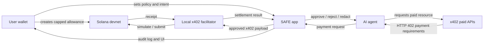

SAFE is not trying to replace x402 or Solana allowances. SAFE sits between the agent and the signer.

## Main Components

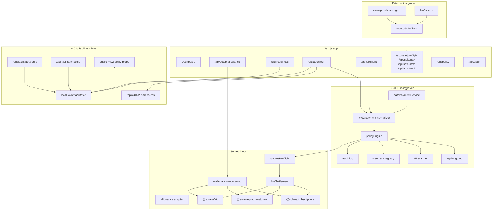

## Onchain And Offchain Boundary

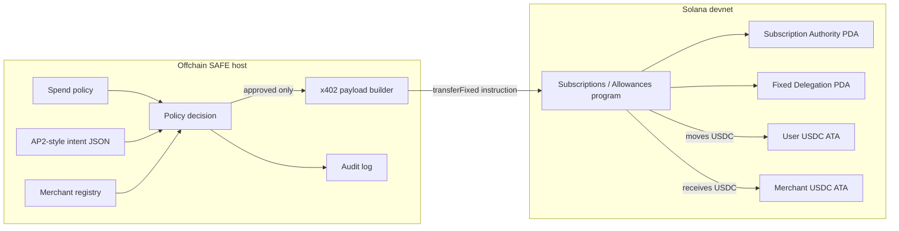

Onchain state enforces money constraints. Offchain policy enforces meaning.

## Allowance Setup Flow

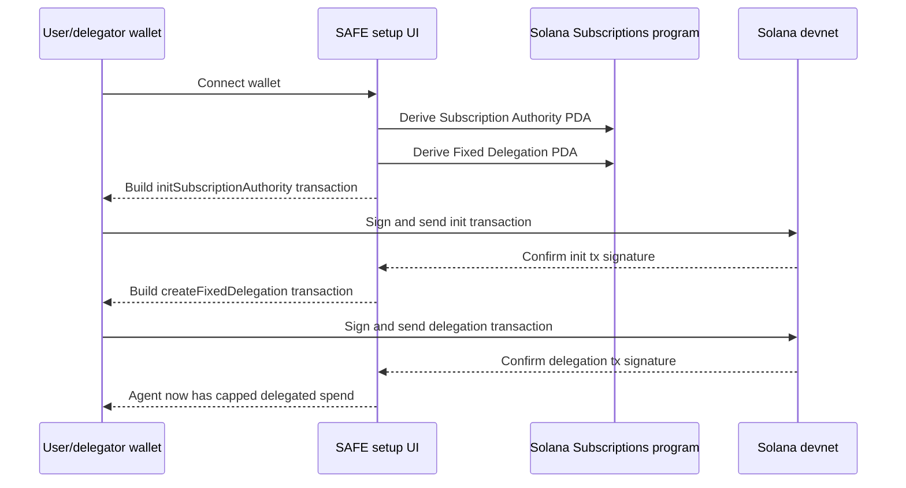

Current primary path:

```text
Open the dashboard, connect a devnet wallet, initialize authority, then create allowance.
```

If the dashboard already shows `Subscription authority: exists` and `Fixed delegation: exists`, setup is complete. Do not sign another setup transaction for that wallet; use `Run Agent` instead.

Legacy env-key smoke command:

```bash
SAFE_DEMO_MODE=false pnpm safe:devnet:setup-allowance
```

## External Agent API

External agents should use the SAFE HTTP API instead of importing the scripted dashboard agent.

```text
POST /api/safe/preflight
POST /api/safe/pay
POST /api/safe/demo/run
GET  /api/safe/state
GET  /api/safe/audit
GET  /api/safe/demo/state
```

`/api/safe/preflight` is advisory only. It normalizes the x402 requirement and evaluates policy with a read-only replay check. It does not settle, write audit records, or remember replay state.

`/api/safe/pay` is the real execution path. It can fetch a local x402 resource URL, parse the `402` challenge, evaluate SAFE policy, settle approved or redacted decisions, write audit records, and return the paid resource response. `dryRun: true` uses the same policy path but does not settle, write audit records, or mutate replay state.

`/api/safe/demo/run` is the CLI-first demo path. It turns a natural-language match-day instruction into a per-run SAFE policy, uses that same policy for enforcement, runs the scripted x402 sequence, writes audit records for non-dry runs, and stores a dashboard-visible demo transcript. Generated policies keep the baseline stats merchant `stats-api.demo` allowlisted unless the prompt explicitly blocks match data or stats. Merch prompts can approve only the trusted `official-merch.demo` merch merchant; fake merch stays blocked. Live devnet is the default caller behavior for `pnpm safe demo`; the route fails before execution when live mode is required but the server is not configured with `SAFE_DEMO_MODE=false` and live allowance signers.

`/api/safe/demo/state` returns the newest demo transcripts. The dashboard polls this route so terminal runs and browser state show the same prompt, policy, x402 requests, SAFE decisions, settlement receipts, and audit summary.

Local wrappers:

```bash
./node_modules/.bin/tsx bin/safe.ts demo --prompt 'Let my match-day agent spend up to $5 on match data, transit, and food vouchers. Block gambling, merch, unknown merchants, and PII.'
./node_modules/.bin/tsx bin/safe.ts demo --prompt 'Let my match-day agent spend up to $5 on match data, transit, and food vouchers. Block gambling, merch, unknown merchants, and PII.' --dry-run
./node_modules/.bin/tsx examples/basic-agent/run.ts --dry-run
./node_modules/.bin/tsx bin/safe.ts pay http://localhost:3000/api/x402/stats --dry-run
```

## Approved Payment Flow

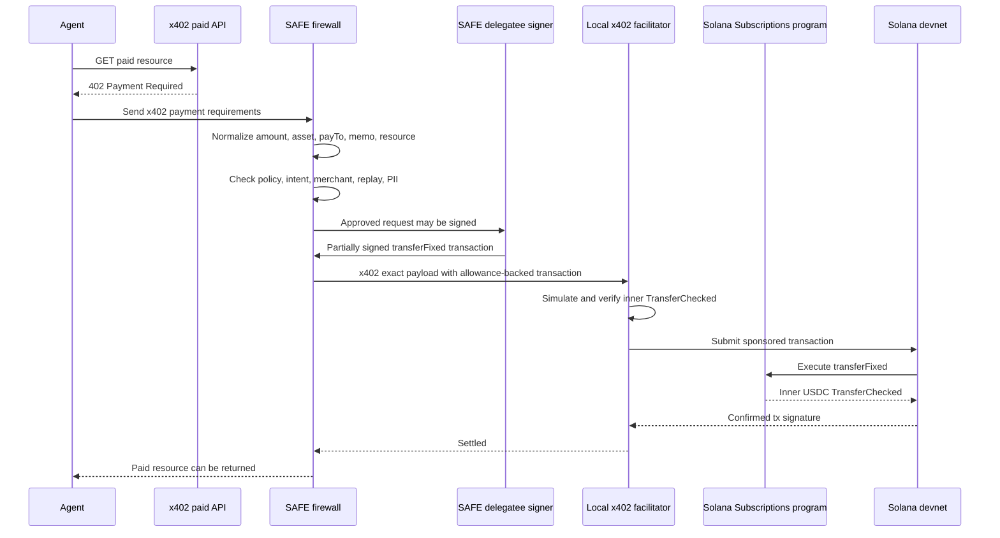

The facilitator should not pull funds from the allowance. The SAFE-approved delegatee signs the transaction. The local x402 facilitator verifies, sponsors, submits, and confirms it.

## Blocked Payment Flow

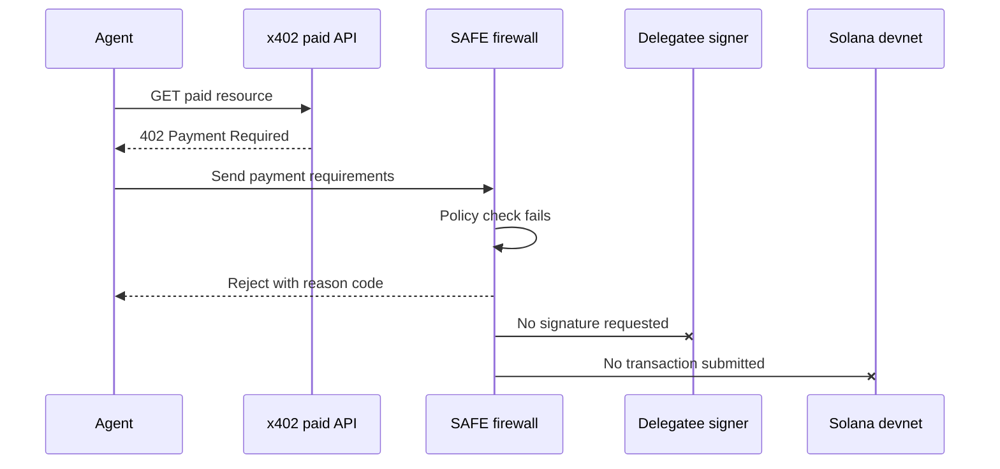

Examples currently shown by the demo:

- Fake merchant blocked.
- Duplicate stats request blocked.
- Over-limit request blocked.
- Sensitive metadata redacted before signing.

## Policy Decision Model

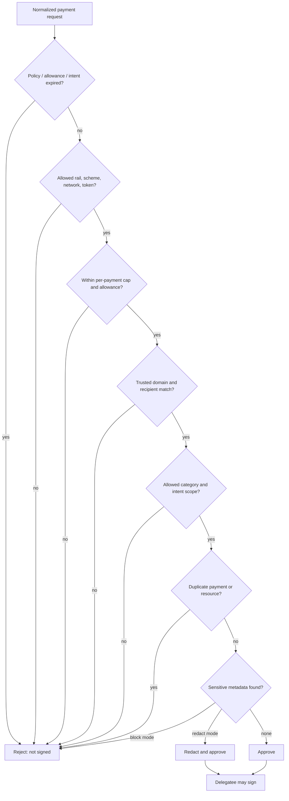

## Future Agentic Verification Mode

This mode is not implemented in the current MVP. It is the next product direction for payments that are unknown to the local registry.

The rule stays strict:

```text
Verifier agents gather evidence.
SAFE makes the decision.
Only SAFE-approved payments can reach signing.
```

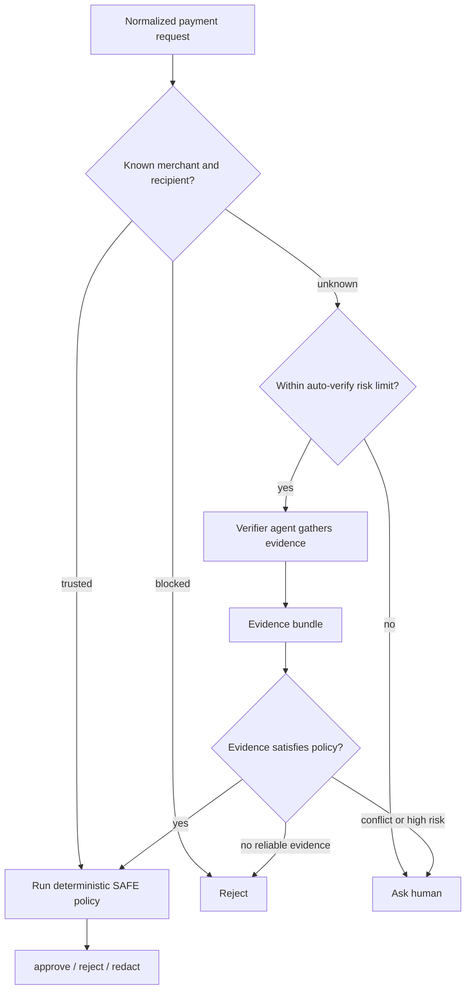

Evidence bundle examples:

- merchant domain ownership proof
- signed merchant manifest
- recipient wallet ownership proof
- token mint and network match
- expected price range
- category classification
- public docs or KYB signal
- prior SAFE audit history
- matching shared trust database record

The verifier should never receive signing authority, private keys, or permission to bypass SAFE. It can only produce evidence and a recommendation.

## Future Shared Trust Layer

SAFE can improve over time if verified decisions are reusable across agents and deployments.

The long-term trust layer should store verified records, not raw unchecked reports:

```text
merchant domain
verified recipient
token mint and network
category
safe price range
evidence sources
policy version
audit receipt hash
review timestamp
confidence level
```

The database can learn from:

- approved payments
- rejected fake merchants
- recipient mismatches
- over-limit requests
- replay attempts
- PII redaction cases
- human review outcomes
- settled transaction receipts

This is similar to how security products combine local rules with shared reputation intelligence. SAFE applies that pattern to payments instead of network traffic.

Decentralization is a possible later form of the shared trust layer, not a current claim. A decentralized version would need anti-spam controls, sybil resistance, privacy-preserving audit sharing, signed evidence, dispute resolution, and governance.

## Production Reference Architecture

The scalable production design should be private-first and hybrid.

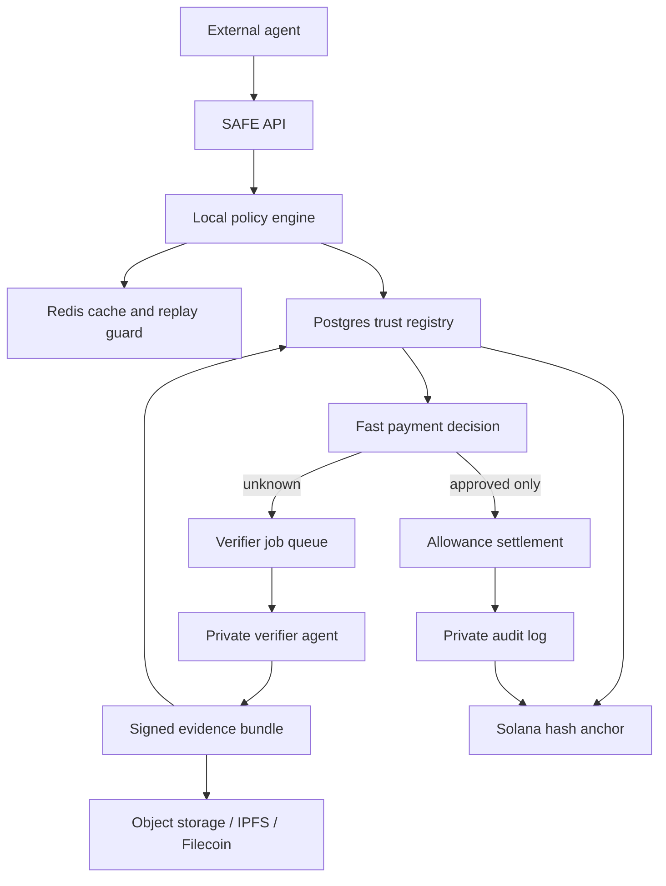

Fast path:

```text
agent -> SAFE -> local policy/cache/registry -> decision
```

Slow path:

```text
unknown merchant -> async verifier job -> evidence bundle -> registry update -> retry or ask human
```

Do not put decentralized storage or public-chain reads in the hot payment path. The hot path needs low latency and clear fail-closed behavior.

Private by default:

- user intent
- raw payment reason
- agent task context
- wallet/payment history
- full audit records
- verifier browsing traces
- rejected sensitive metadata

Safe to share after sanitization:

- verified merchant domain
- verified recipient or token account
- supported token and network
- category
- normal price range
- risk score
- evidence hash
- review status
- expiry timestamp

Recommended infrastructure split:

| Component | Production role |
|---|---|
| Postgres | source of truth for trust records, policy versions, reviews |
| Redis | fast replay guard, risk cache, rate limits, idempotency |
| Queue | async verifier jobs and human-review workflows |
| Object storage | private evidence storage for enterprise deployments |
| IPFS/Filecoin | durable public or semi-public evidence bundles later |
| Solana | hash anchors, merchant attestations, disputes, receipts |
| 0G | later option for AI-native DA, verifier data, or decentralized compute |

## x402 Compatibility Paths

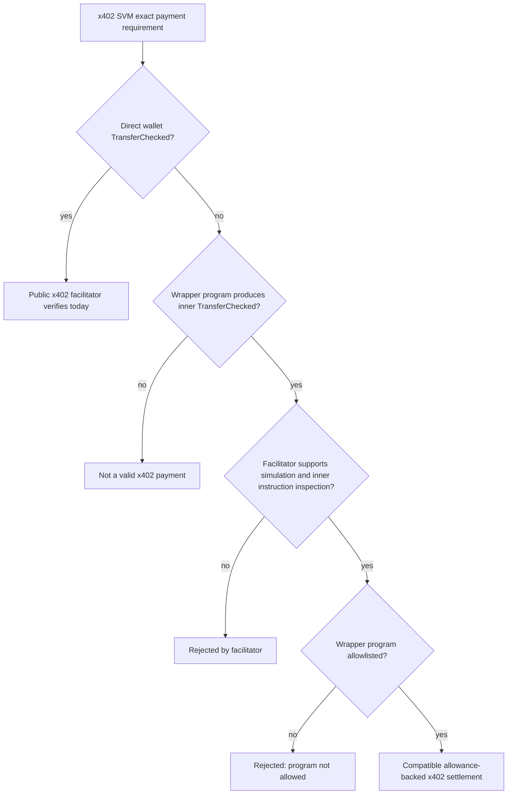

Current public x402 result:

```text
Direct wallet x402 control payload: valid.
SAFE transferFixed allowance payload: rejected.
Reason: smart_wallet_program_not_allowed for the Subscriptions program.
```

## Runtime Modes

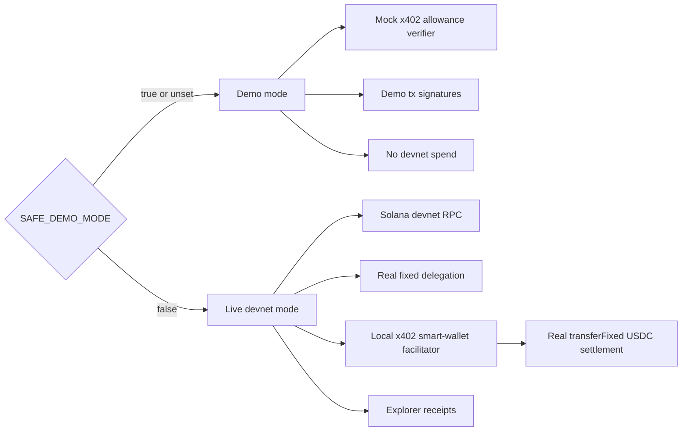

Be careful: live mode spends real devnet USDC from the connected wallet allowance.

## Frontend Demo Surface

The browser dashboard is the primary demo surface, not just the CLI.

What the frontend now shows:

- Live readiness checks for RPC, mode, delegatee signer, facilitator, and legacy smoke signers.
- Env wallet balances for user/delegator, agent/delegatee, and facilitator/sponsor.
- Allowance status, including delegation PDA, delegatee, amount, and expiry.
- One-click agent run with before/after user USDC balances.
- Per-attempt SAFE decision, x402 request fields, facilitator result, payment hash, tx signature, and Explorer link.
- Audit timeline for approved, blocked, redacted, and settled payments.

The CLI scripts remain useful for development, but they are no longer required to explain the product during a demo.

## API Surface

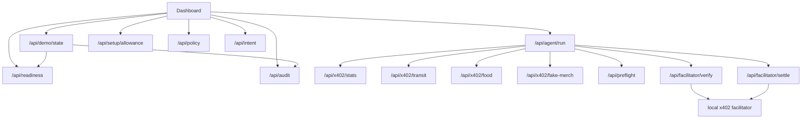

## Key Files

| Area | Files |
|---|---|
| Agent scenario | `lib/agent/worldCupAgent.ts` |
| Policy engine | `lib/policy/policyEngine.ts` |
| x402 requirements | `lib/x402/paymentRequirements.ts` |
| Mock x402 payload | `lib/x402/x402Payload.ts` |
| Demo verifier | `lib/facilitator/facilitatorVerifier.ts` |
| Local x402 facilitator | `lib/facilitator/localX402Facilitator.ts` |
| Wallet allowance setup | `lib/solana/walletAllowanceSetup.ts` |
| Live Solana settlement | `lib/solana/liveSettlement.ts` |
| Readiness checks | `lib/runtime/readiness.ts` |
| Frontend demo state | `lib/runtime/demoState.ts` |
| Runtime live preflight | `lib/solana/runtimePreflight.ts` |
| Merchant registry | `lib/fixtures/merchants.ts` |
| Devnet scripts | `scripts/devnet/*` |

## Devnet Commands

```bash
pnpm safe:devnet:balances
# Or use the dashboard wallet setup panel.
SAFE_DEMO_MODE=false pnpm safe:devnet:setup-allowance
SAFE_DEMO_MODE=false pnpm safe:devnet:smoke
pnpm safe:x402:public:verify
```

## What This App Is Not

- Not full production x402 compatibility with every facilitator.
- Not full AP2 credential exchange.
- Not mainnet-ready.
- Not a custodial wallet.
- Not an implemented global trust database yet.
- Not an implemented autonomous verifier-agent network yet.
- Not a decentralized reputation protocol yet.
- Not generated from `solana.new` in the current repo.

## Best Demo Framing

SAFE is a payment firewall for agents. It lets an agent spend from a capped Solana allowance, but only after SAFE approves each x402-style payment request. Good payments settle on devnet. Bad payments never get signed.
